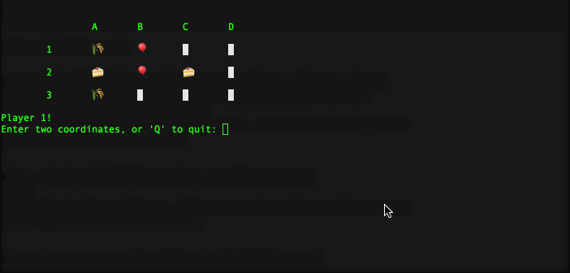

# Memory
> A basic implementation of the card game within the console

	

## About
To learn about this project, please see the [design document](docs/Memory Design Doc.pdf).

## Building & Running
This project uses Maven as a build system. Execute `mvn package` while in the project root directory to package the program into a jar, then `java -cp target/Memory-1.0-SNAPSHOT.jar memory.Memory -Dfile.encoding=UTF-8` to run the program. The flag at the end is to ensure that the emojis render correctly.
